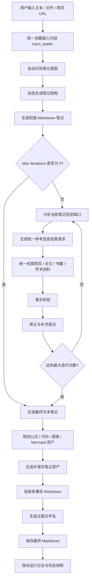

# Note Agent

一个基于 **LangGraph + LangChain + DeepSeek API / OpenAI Compatible APIs** 构建的自动研究笔记 Agent。

项目目标不是简单整理文本，而是根据用户输入自动生成研究笔记，并通过统一参考信息检索、事实核验、多轮修正、结构优化和多模态资产生成，最终输出可复盘、可引用、可维护的结构化 Markdown 笔记。

当前主版本为 **v4.0.0**，采用 **LangGraph 状态机架构**，支持多输入源、动态笔记结构、统一参考信息检索、事实检验、多轮迭代、多模型选择、搜索缓存、运行日志持久化、中间版本保存、多模态资产生成，以及 Streamlit 可视化交互界面。

---

## v4.0.0 更新内容

v4.0.0 在 v3.4.0 的可观测 Agent 工作流基础上，重点进行了两类升级：

1. 在原有网络检索能力基础上，加入更多类型的参考信息检索来源，包括论文、书籍和综合学术资料
2. 新增公式、代码、Mermaid 图和图表等多模态笔记资产生成能力

本版本的核心目标是：

> 让 Agent 不只生成文本笔记，而是能够根据笔记内容主动检索多类型参考信息，并在合适位置生成公式、代码、流程图和图表，最终输出更接近研究助理产物的 Markdown 笔记。
---

## v4.0.0 核心变化

### 1. 从网络检索升级为统一参考信息检索

v3.4.0 中，Agent 已经支持结构化网络检索、搜索缓存和基于搜索结果的事实核验。

v4.0.0 在此基础上进一步扩展检索范围，将参考信息来源统一抽象为：

```text
src/note_agent/retrieval.py
```

统一检索覆盖以下参考信息类型：

```text
web       官方文档、教程、博客、新闻、项目资料、网页内容
paper     论文、预印本、算法来源、实验方法、benchmark、SOTA
book      教材、专著、经典书籍、系统性理论来源
academic  综合学术资料，包括论文、书籍章节、学位论文、数据集等
```

Agent 会根据当前笔记的信息缺口，自动生成统一检索请求：

```json
{
  "reference_queries": [
    {
      "query": "retrieval augmented generation survey",
      "source_types": ["paper", "academic"],
      "reason": "补充 RAG 方法的论文依据和综述来源"
    },
    {
      "query": "LangGraph documentation state graph agent workflow",
      "source_types": ["web"],
      "reason": "补充官方文档和工程实现资料"
    }
  ]
}
```

---

### 2. 参考信息来源

当前统一检索模块内置以下来源：

#### Web Sources

- DuckDuckGo
- Tavily
- Perplexity
- SearXNG

#### Paper Sources

- Semantic Scholar
- arXiv

#### Book Sources

- Google Books
- Open Library

#### Academic Sources

- OpenAlex
- Semantic Scholar

其中 `Search API` 选项现在主要用于控制 **web 类型检索的后端**。论文、书籍和综合学术资料由统一检索模块自动选择对应来源。

---

### 3. 多模态笔记资产生成

v4.0.0 新增资产生成模块：

```text
src/note_agent/assets.py
src/note_agent/asset_tools.py
```

支持生成：

```text
formula   LaTeX 公式块
code      代码块
mermaid   Mermaid 流程图 / 状态图 / 架构图
chart     基于结构化数据的 matplotlib 图表
```

Agent 会先规划当前笔记是否需要资产：

```json
[
  {
    "asset_type": "formula",
    "purpose": "解释 Bellman 方程及变量含义",
    "insert_after_heading": "核心原理",
    "priority": "high"
  },
  {
    "asset_type": "mermaid",
    "purpose": "展示 Agent 工作流",
    "insert_after_heading": "系统架构",
    "priority": "medium"
  }
]
```

然后再根据资产计划生成对应内容，并自动插入最终 Markdown。

---

## 功能特点

## 功能特点

- **多输入源支持**：支持文本、关键词、研究主题输入，也支持导入 `.txt` / `.md` 文件和网页 URL。
- **自动笔记生成**：自动识别笔记类型，动态生成笔记结构，并生成初版 Markdown 笔记。
- **统一参考信息检索**：自动分析信息缺口，生成 Reference Query，并统一检索网页、论文、书籍和综合学术资料。
- **结构化证据管理**：支持 Reference Query 去重、结构化参考信息结果、参考信息缓存，以及基于证据的事实检验。
- **多轮迭代优化**：根据参考证据对笔记进行事实修正、内容补充和结构优化，支持多轮迭代。
- **多模态资产生成**：支持生成 LaTeX 公式、代码块、Mermaid 图和 matplotlib 图表，并自动组装进最终 Markdown。
- **运行过程可观测**：支持中间版本保存、运行日志持久化、LangGraph 节点展示和当前步骤逐字流式输出。
- **可视化交互界面**：提供 Streamlit 界面，支持输入、运行、预览、来源查看和生成路径展示。
- **自动文件管理**：自动生成体现主题的文件名，清理 Markdown 代码块包裹，并保存最终 Markdown 文件。
- **面向长期知识管理**：支持知识积累、研究笔记沉淀，并可继续扩展为完整个人知识 Agent。

---

## 技术栈

- **开发语言**：Python
- **Agent 框架**：LangChain、LangGraph
- **模型接口**：DeepSeek API、OpenAI Compatible APIs
- **参考信息检索**：DDGS Search、Tavily、Perplexity、SearXNG、Semantic Scholar、arXiv、OpenAlex、Google Books、Open Library
- **数据建模与工程工具**：Pydantic、Requests、python-dotenv
- **内容解析与 Markdown 处理**：BeautifulSoup4、Markdown
- **多模态资产生成**：Matplotlib、Mermaid、LaTeX、代码块
- **前端界面**：Streamlit

---

## 项目结构

```text
note-agent/
│
├─ .env
├─ .env.example
├─ .gitignore
├─ pyproject.toml
├─ uv.lock
├─ requirements.txt        # legacy / pip fallback
├─ README.md
├─ app.py
├─ scripts/
│  ├─ main.py              # compatibility wrapper
│  ├─ demo1.py
│  └─ demo2.py
│
├─ notes/
│  ├─ intermediate/
│  └─ assets/
│
├─ runs/
│
├─ .cache/
│  └─ references/
│
├─ src/
│  └─ note_agent/
│     ├─ __init__.py
│     ├─ __main__.py
│     ├─ cli.py
│     ├─ state.py
│     ├─ schemas.py
│     ├─ models.py
│     ├─ storage.py
│     ├─ config.py
│     ├─ prompts.py
│     ├─ tools.py
│     ├─ input_loader.py
│     ├─ retrieval.py
│     ├─ assets.py
│     ├─ asset_tools.py
│     ├─ service.py
│     └─ graph.py
```

---

## 核心模块说明

### `app.py`

Streamlit 可视化前端入口。

主要功能：

- 选择 LLM Provider
- 选择 Web Search Backend
- 设置最大迭代次数
- 输入手动文本
- 上传 `.txt` / `.md` 文件
- 输入网页 URL
- 展示运行节点
- 展示当前节点流式输出
- 展示检索过程
- 展示 Sources
- 展示最终 Markdown 笔记
- 展示保存路径、运行 ID、运行日志目录、中间版本路径和生成资产路径

---

### `src/note_agent/cli.py`

命令行入口。

支持：

- 手动输入
- 本地文件路径导入
- 网页 URL 导入
- 选择模型
- 选择 Web Search Backend
- 设置迭代次数
- 输出最终保存路径
- 输出运行日志目录
- 输出中间版本路径
- 输出参考来源
- 输出生成资产路径

`scripts/main.py` 仅保留为兼容 wrapper。正式命令行入口由 `pyproject.toml` 暴露为 `note-agent`。

---

### `src/note_agent/input_loader.py`

统一输入加载模块。

负责处理：

- 手动文本
- 本地 `.txt` / `.md` 文件
- Streamlit 上传文件
- 网页 URL
- 多来源内容合并

---

### `src/note_agent/retrieval.py`

统一参考信息检索模块。

负责处理：

- 网页资料检索
- 论文检索
- 书籍检索
- 综合学术资料检索
- 参考信息去重
- 参考信息格式化
- 来源链接收集

统一返回：

```text
ReferenceItem
```

---

### `src/note_agent/assets.py`

多模态资产数据结构模块。

包括：

- `AssetPlanItem`
- `FormulaBlock`
- `CodeBlock`
- `MermaidBlock`
- `ChartBlock`
- `GeneratedAssets`

---

### `src/note_agent/asset_tools.py`

多模态资产处理模块。

负责：

- 解析资产规划
- 解析资产生成结果
- 保存公式索引
- 保存代码文件
- 保存 Mermaid 文件
- 保存图表规格
- 使用 matplotlib 生成图表图片
- 将资产转换为 Markdown
- 将资产插入最终笔记

---

### `src/note_agent/graph.py`

LangGraph 状态机核心。

负责定义 Agent 工作流节点：

- `infer_note_type`
- `generate_dynamic_outline`
- `generate_initial_note`
- `generate_reference_queries`
- `retrieve_references`
- `verify_note`
- `refine_note`
- `finalize_note`
- `plan_note_assets`
- `generate_note_assets`
- `assemble_assets_into_note`
- `save_markdown`

---

### `src/note_agent/storage.py`

运行记录、参考信息缓存和资产保存模块。

负责：

- 创建运行目录
- 保存运行摘要
- 保存运行事件
- 保存最终状态快照
- 保存中间版本笔记
- 保存资产文件
- 读取和写入参考信息缓存

---

### `src/note_agent/service.py`

Service Layer。

负责：

- 构造初始状态
- 调用 LangGraph
- 封装同步运行接口
- 封装流式运行接口
- 接入运行日志
- 返回标准化响应对象

---

## 工作流程



---

## 输出目录说明

v4.0.0 会产生以下主要输出目录。

---

### `notes/`

`notes/` 用于保存最终生成的 Markdown 笔记。

示例：

```text
notes/LangGraph_Agent_20260522_120301.md
```

最终笔记通常包含：

- 笔记标题
- 主题概述
- 核心概念
- 结构化内容
- 实践要点或研究要点
- 自动生成公式
- 自动生成代码块
- 自动生成 Mermaid 图
- 自动生成图表
- Sources 来源链接

---

### `notes/intermediate/`

`notes/intermediate/` 用于保存每次运行过程中的中间版本笔记。

示例：

```text
notes/intermediate/run_20260522_120301_ab12cd34/
├─ iteration_0_initial.md
├─ iteration_1_refined.md
├─ iteration_2_refined.md
├─ final_text_only.md
└─ final_with_assets.md
```

这些中间版本主要用于调试和复盘。

例如，当最终笔记质量不理想时，可以查看：

- 初版笔记是否已经偏题
- 第几轮检索后内容开始变差
- 哪一轮引入了错误信息
- 多模态资产是否插入到了正确位置
- 最终整理是否删掉了重要内容

---

### `notes/assets/`

`notes/assets/` 用于保存自动生成的笔记资产。

示例：

```text
notes/assets/run_20260522_120301_ab12cd34/
├─ formula_index.json
├─ code_001.py
├─ diagram_001.mmd
├─ chart_001.json
└─ chart_001.png
```

不同文件含义：

- `formula_index.json`：公式块结构化数据
- `code_001.py`：生成的代码示例
- `diagram_001.mmd`：Mermaid 图源文件
- `chart_001.json`：图表结构化数据
- `chart_001.png`：matplotlib 渲染出的图表图片

---

### `runs/`

`runs/` 用于保存每次 Agent 运行的日志和状态快照。

示例：

```text
runs/run_20260522_120301_ab12cd34/
├─ run.json
├─ events.jsonl
└─ final_state.json
```

其中：

#### `run.json`

保存本次运行的摘要信息。

通常包括：

```text
run_id
status
raw_input_preview
llm_provider
search_api
max_iterations
saved_path
error
created_at
updated_at
```

#### `events.jsonl`

保存 Agent 运行过程中的事件日志。

通常包括：

- 节点开始事件
- 统一检索过程事件
- 中间版本保存事件
- 资产生成事件
- 最终文件保存事件
- 错误事件

#### `final_state.json`

保存最终状态快照摘要。

通常包括：

- `note_type`
- `iteration_count`
- `used_reference_queries`
- `sources`
- `saved_path`
- `intermediate_paths`
- `asset_paths`
- `current_note` 摘要
- `verification_report` 摘要
- `final_note` 摘要
- `reference_results_count`
- `evidence_items_count`
- `generated_assets`

---

### `.cache/references/`

`.cache/references/` 用于保存统一参考信息检索缓存。

缓存 key 基于：

```text
source_name + query + max_results
```

它可以缓存：

- 网页检索结果
- 论文检索结果
- 书籍检索结果
- 综合学术检索结果

这样可以减少：

- 搜索 API 调用次数
- 网络请求时间
- 重复 query 带来的不稳定结果
- 调试时的重复等待

如果希望强制重新检索，可以删除：

```text
.cache/references/
```

---

## Streamlit 可视化界面

运行方式：

```bash
uv run streamlit run app.py
```

启动后浏览器会打开：

```text
http://localhost:8501
```

界面主要包括：

```text
左侧 Sidebar：
- LLM Provider 选择
- Web Search Backend 选择
- Max Iterations 设置
- 当前功能说明

主页面左侧：
- 手动文本输入
- .txt / .md 文件上传
- 网页 URL 输入
- 运行节点展示

主页面右侧：
- 当前步骤逐字输出
- 检索过程 / 中间版本信息
- Sources

底部：
- 最终 Markdown 笔记预览
- 保存路径
- 运行 ID
- 运行日志目录
- 中间版本路径
- 生成资产路径
```

---

## 安装

当前分支以 `uv + pyproject.toml + src/` 布局为主。

安装依赖并创建虚拟环境：

```bash
uv sync
```

如果只需要运行依赖：

```bash
uv sync --no-dev
```

---

## 环境变量配置

复制 `.env.example` 为 `.env`：

```bash
cp .env.example .env
```

Windows PowerShell：

```powershell
copy .env.example .env
```

配置 `.env`：

```env
DEEPSEEK_API_KEY=
OPENAI_API_KEY=
DASHSCOPE_API_KEY=
MOONSHOT_API_KEY=
ZHIPU_API_KEY=
SILICONFLOW_API_KEY=

SEARCH_API=duckduckgo

TAVILY_API_KEY=
PERPLEXITY_API_KEY=
SEARXNG_URL=

SEMANTIC_SCHOLAR_API_KEY=

DEFAULT_LLM_PROVIDER=deepseek
DEFAULT_MAX_ITERATIONS=2
```

说明：

- 默认模型提供方为 `deepseek`
- 默认 Web Search Backend 为 `duckduckgo`
- 使用 Tavily 需要配置 `TAVILY_API_KEY`
- 使用 Perplexity 需要配置 `PERPLEXITY_API_KEY`
- 使用 SearXNG 需要配置 `SEARXNG_URL`
- `SEMANTIC_SCHOLAR_API_KEY` 可选，不填也可以使用 Semantic Scholar，但配置后更稳定

---

## 运行方式

### 命令行运行

```bash
uv run note-agent
```

兼容方式：

```bash
uv run python scripts/main.py
```

命令行模式支持：

- 手动输入文本
- 输入本地 `.txt` / `.md` 文件路径
- 输入网页 URL
- 设置迭代次数
- 选择 LLM Provider
- 选择 Web Search Backend
- 输出最终笔记保存路径
- 输出运行 ID
- 输出运行日志目录
- 输出中间版本路径
- 输出参考来源
- 输出生成资产路径

---

### 可视化界面运行

```bash
uv run streamlit run app.py
```

可视化模式支持：

- 手动输入文本
- 上传 `.txt` / `.md`
- 输入网页 URL
- 设置迭代次数
- 实时观察运行节点
- 实时查看当前步骤输出
- 查看检索过程
- 查看 Sources
- 查看最终 Markdown 笔记
- 查看运行 ID
- 查看运行日志目录
- 查看中间版本路径
- 查看生成资产路径

---

## 版本说明

### v4.0.0（当前版本）

新增：

- 统一参考信息检索模块 `retrieval.py`
- 覆盖网页、论文、书籍和综合学术资料
- 统一数据结构 `ReferenceItem`
- 统一检索请求 `ReferenceQuery`
- 参考信息缓存 `.cache/references/`
- 多模态资产结构 `assets.py`
- 多模态资产工具 `asset_tools.py`
- 公式生成
- 代码生成
- Mermaid 图生成
- matplotlib 图表生成
- 资产目录 `notes/assets/{run_id}/`
- 多模态 Markdown 自动组装
- Streamlit 展示生成资产路径
- CLI 展示生成资产路径
- LangGraph 新增资产规划与资产生成节点

---

### v3.4.0

新增：

- 多输入源支持
- `input_loader.py`
- 结构化搜索结果 `SearchResultItem`
- 搜索缓存 `.cache/search/`
- 运行日志持久化 `runs/{run_id}/`
- 中间版本笔记保存 `notes/intermediate/{run_id}/`
- 运行 ID
- 最终状态快照
- Streamlit 文件上传
- Streamlit 网页 URL 输入
- Max Iterations 支持 `0`
- Service Layer 接入运行日志
- 搜索结果作为结构化证据参与事实核验

---

### v3.3.0

新增：

- Streamlit 可视化界面
- 运行节点展示
- 当前步骤逐字流式输出
- 检索 Query / 搜索过程展示
- Sources 展示
- 最终 Markdown 预览
- 可滚动文本框 UI
- 保留 CLI 与 Service Layer 复用能力

---

### v3.2.0

新增：

- 多模型支持
- 多搜索后端
- Query 去重
- 信息差驱动检索
- Service Layer
- Schema 标准化
- 前后端解耦
- `.env.example`
- 搜索配置系统

---

### v3.1.0

新增：

- `verify_note`
- 事实检验
- Markdown 清洗
- 自动标题生成
- 文件名优化

---

### v3.0.0

新增：

- LangGraph 状态机
- 自动笔记生成
- 动态结构
- 网络检索
- 多轮迭代

---

## Roadmap

### v4.1

计划增强本地资料处理能力：

- PDF 输入
- Word 输入
- 本地文档解析
- 网页正文提取增强
- 文件级元数据保存
- 文档分块和摘要压缩

---

### v4.2

计划增强知识库与 RAG 能力：

- 本地 RAG
- 向量数据库
- 笔记语义检索
- 本地资料索引
- 多轮知识积累
- 跨笔记引用

---

### v5.0

计划向完整个人 Agent 助手扩展：

- 多 Agent 协作
- 自动学习规划
- 项目知识库
- 知识图谱构建
- 更完整的前端应用
- 个人 Agent 助手化
- 任务管理与提醒
- 多项目上下文隔离

---

## Historical Demo Versions

项目早期版本保留为 Demo，用于展示功能演化过程。

### Demo v1

基础笔记整理 Agent：

- 输入原始文本
- 自动生成标题
- 提取核心知识点
- 输出 Markdown
- 自动保存本地笔记

---

### Demo v1.5

在 v1 基础上增加：

- 支持 `.txt`
- 支持 `.md`
- 文件导入
- 流式输出
- 自动文件命名
- 输入方式选择
- 输入合法性检查

---

## License

MIT
